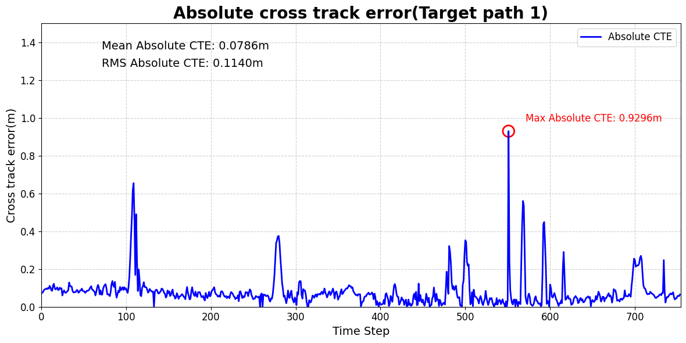
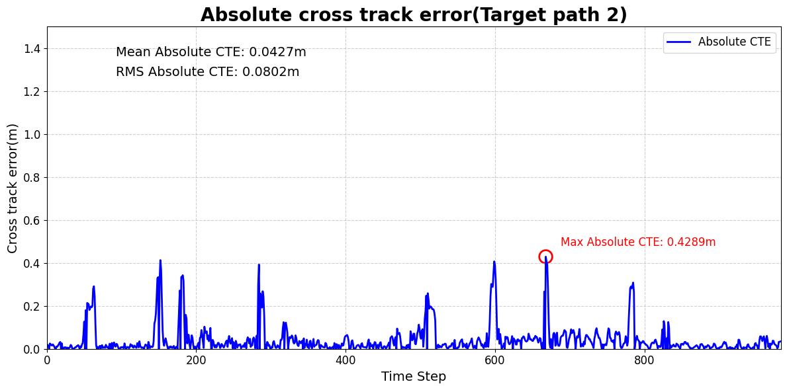

# 🚗 GNSS-based Lateral Control System for Autonomous Vehicles

[]()  
*A foundational system for GNSS+IMU based path tracking & steering control in real environments*

---

## 📌 Overview

This repository accompanies the research titled:  
**"Development of a Basic GNSS-based Lateral Control System for Autonomous Vehicles"**  
by *Hongseung Kim* and *Yong-Gu Lee* (Under Review - JCDE, 2025).

🚘 **Goal**: To implement a robust lateral control system using GNSS and IMU only —  
enabling path tracking without HD map data, in real-world driving environments.

---

## 🧭 Key Features

- RTK-GNSS + IMU positioning with heading estimation
- Path coordinate collection in unstructured environments
- Stanley method for path tracking
- PID controller for steering angle refinement
- Real-vehicle testing on GIST campus

---

## 🎥 Driving Demo


---

## 🖼️ System Architecture

### 📍 Sensor & Module Configuration


### ⚙️ Overall System Flow


---

## 📈 Performance Evaluation

### ➤ Absolute CTE – Target Path 1  


### ➤ Absolute CTE – Target Path 2  


---

## 📂 Folder Structure

```
📁 fig/               → Images and plots for README  
📄 README.md          → This file  
📄 paper.pdf          → (To be uploaded after acceptance)  
```

---

<!--
## 📖 Citation

```bibtex
@article{kim2025gnss,
  title={Development of a Basic GNSS-based Lateral Control System for Autonomous Vehicles},
  author={Kim, Hongseung and Lee, Yong-Gu},
  journal={Journal of Computational Design and Engineering},
  year={2025}
}
```
-->

📝 *Citation info will be added after publication.*

---

## 🙌 Acknowledgements

- Korea Institute for Advancement of Technology (KIAT), MOTIE [P0020535]  
- GIST Research Project Grant (2024)

---

## 📬 Contact

For inquiries or collaboration:  
**Hongseung Kim** | hongseung.kim@gist.ac.kr
