#  GNSS-based Lateral Control System for Autonomous Vehicles

*A GNSS based control system for real time path tracking and steering control of autonomous vehicles in real world environments*

---

## 📌 Overview

This repository accompanies the research titled :

**"Development of a basic GNSS-based lateral control system for autonomous vehicles"**  by *Hongseung Kim* and *Yong-Gu Lee*

🚘 **Goal**: 

This research aims to implement a robust lateral control system that overcomes key limitations such as the absence of path coordinate data and the use of minimal sensor configurations relying solely on GNSS and IMU.

---

## 🎥 Driving Demo

<p align="center">
  <a href="https://youtu.be/ewxYHlESX0o">
    
  </a>
</p>

---

## 🖼️ System Architecture

### 📍 Configuration of onboard sensors and control modules 
<p align="center">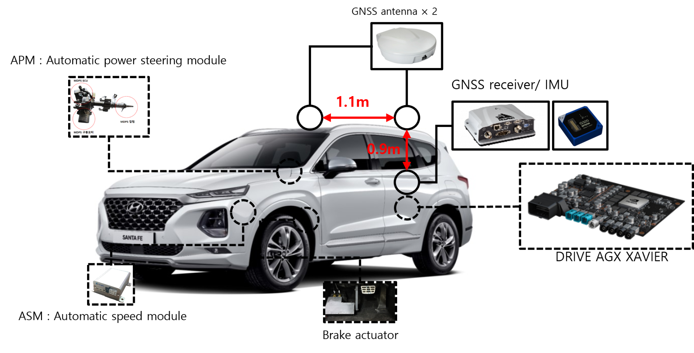</p>

### ⚙️ Overall System Flow  
<p align="center">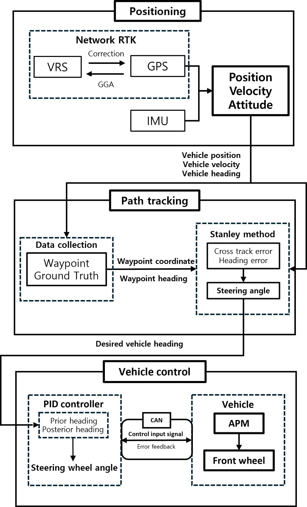</p>

---

## 🗺️ Target paths (Satellite View)

<p align="center">
  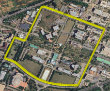
  &nbsp;&nbsp;&nbsp;
  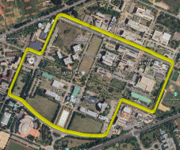
</p>
<p align="center"><b>Figure.</b> Satellite View of Target Path 1 (left) and Target Path 2 (right)</p>

---

## 📂 Target Path Data

<p align="left"><b>CSV Format Specification</b></p>

| Column | Description                                  |
|--------|----------------------------------------------|
| 1      | UTM X coordinate (easting, in meters)        |
| 2      | UTM Y coordinate (northing, in meters)       |
| 3      | Heading angle (°), calculated from waypoints |

<p align="center"><b>📥 Download</b></p>

<p align="center">
  <a href="data/target_path1.csv">Target Path 1 CSV</a> &nbsp;&nbsp;|&nbsp;&nbsp;
  <a href="data/target_path2.csv">Target Path 2 CSV</a>
</p>


---

## 📊 Path Tracking Performance Summary

<p align="center">

| Metric              | Target Path 1 | Target Path 2 |
|---------------------|---------------|---------------|
| MAE (m)             | 0.0786        | 0.0427        |
| RMSE (m)            | 0.1140        | 0.0802        |
| Avg Heading Error ° | 2.1411°       | 2.5000°       |

</p>

---

## 📈 Experiment Results

### Target Path 1  
- Trajectory  
  <p align="center">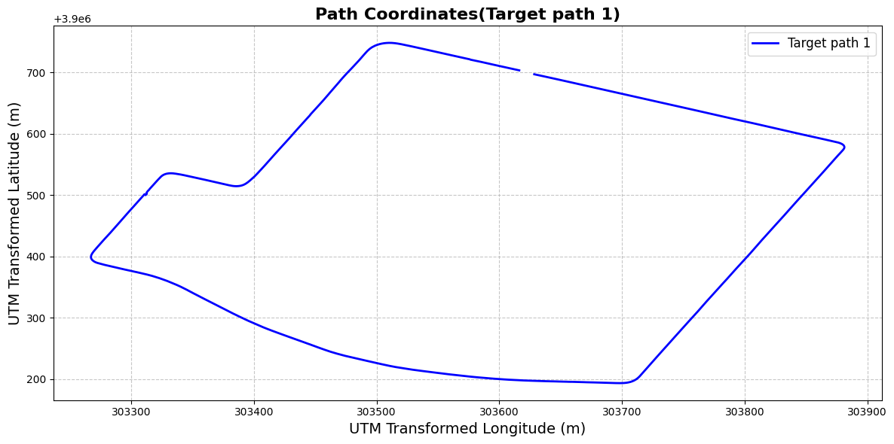</p>  
- Waypoint Heading  
  <p align="center">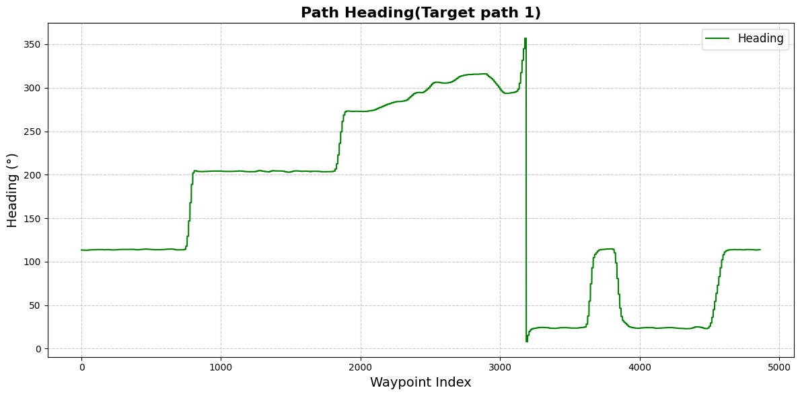</p>  
- Absolute Cross Track Error  
  <p align="center">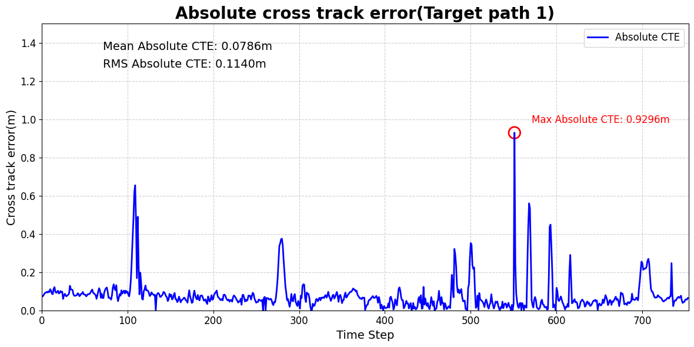</p>  
- Posterior vs Desired Heading  
  <p align="center">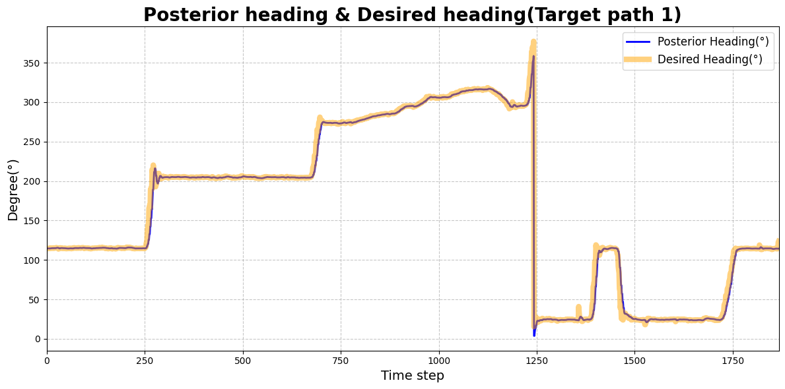</p>

### Target Path 2  
- Trajectory  
  <p align="center">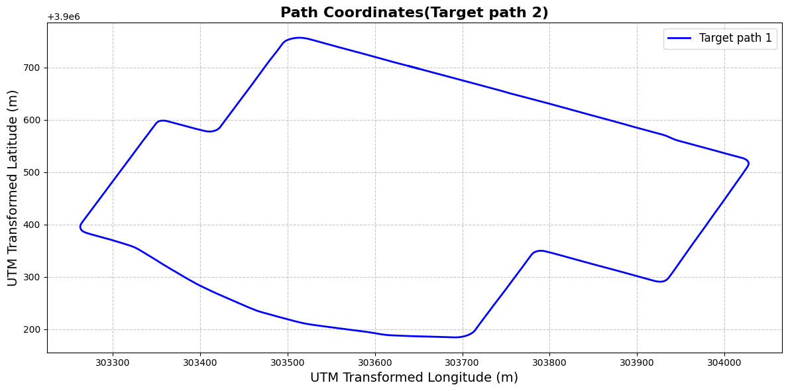</p>  
- Waypoint Heading  
  <p align="center">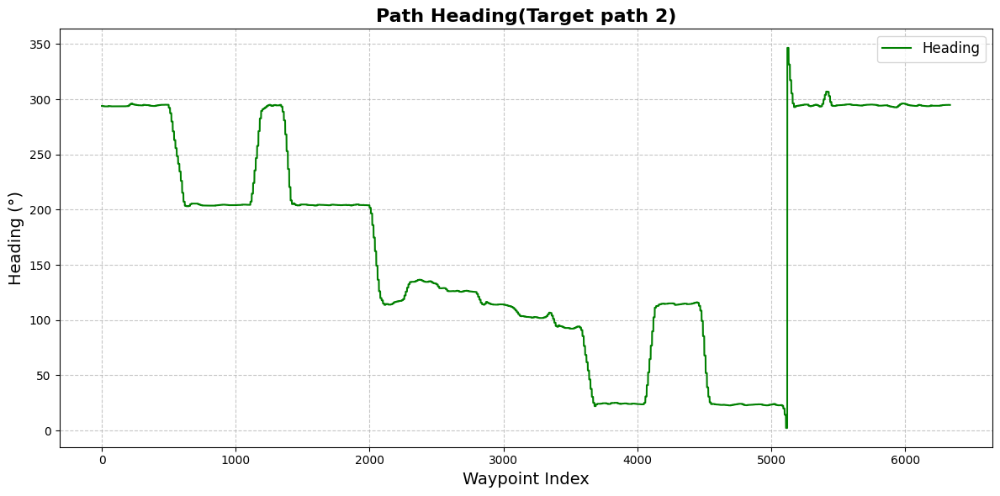</p>  
- Absolute Cross Track Error  
  <p align="center">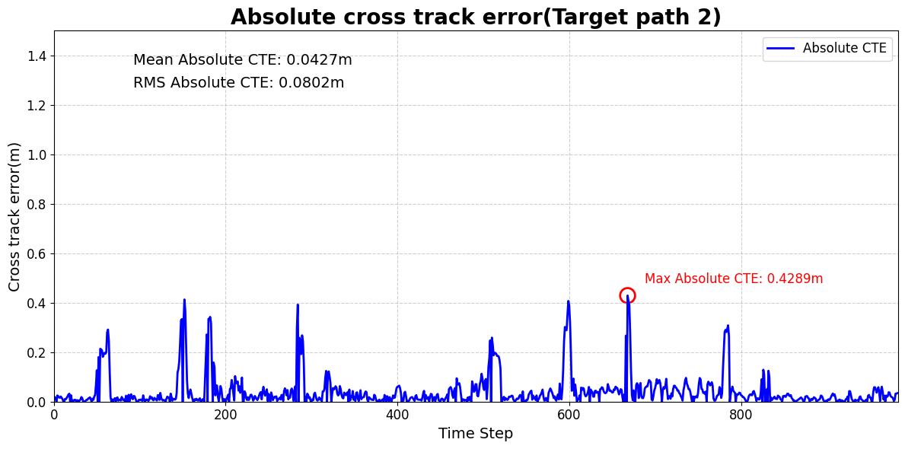</p>  
- Posterior vs Desired Heading  
  <p align="center">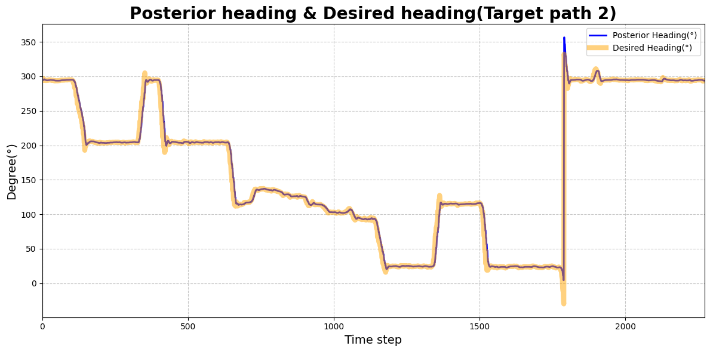</p>

---

## 🧪 Performance Comparison

The following table summarizes and compares the proposed system with other lateral control systems in real-vehicle studies. 
The final three columns show a **proposed metric**, calculated by dividing each error by the total path length and multiplying by 1000(dimensionless).

| Research article            | Method                | Distance(m) | Max Error(m) | MAE(m)     | RMSE(m)    | Max*       | MAE*      | RMSE*      |
|-----------------------------|-----------------------|-------------|-----------   |------------|------------|------------|-----------|------------|
| Dominguez et al. (2021)     | Pure Pursuit          | 1,000       | 0.3600       | –          | –          | 0.3600     | –         | –          |
| Dominguez et al. (2021)     | Stanley Method        | 1,000       | 0.4000       | –          | –          | 0.4000     | –         | –          |
| Dominguez et al. (2021)     | Sliding Mode Control  | 1,000       | 0.4000       | –          | –          | 0.4000     | –         | –          |
| Dominguez et al. (2021)     | LatVel                | 1,000       | **0.3000**   | –          | –          | 0.3000     | –         | –          |
| Park et al. (2014)          | Adaptive Pure Pursuit | 1,400       | 0.4000       | –          | –          | 0.2857     | –         | –          |
| Hossain et al. (2022)       | LQR+PID               | **4,200**   | –            | 0.0953     | –          | –          | 0.0226    | –          |
| Baksaas et al. (2021)       | LatVel                | 700         | –            | –          | 0.1630     | –          | –         | 0.2329     |
| Baksaas et al. (2021)       | LatVel                | 700         | –            | –          | 0.2730     | –          | –         | 0.3900     |
| **This study**              | Stanley + PID (1)     | 1,800       | -0.9296      | 0.0786     | 0.1140     | 0.5160     | 0.0436    | 0.6333     |
| **This study**              | Stanley + PID (2)     | 2,200       | 0.4289       | **0.0427** |**0.0802**  | **0.1950** |**0.0194** | **0.0365** |

> 🔹 **Bold** entries highlight the best or most notable performance metrics.  
> \* Proposed metric = (error ÷ distance) × 1000

---

<!--
## 📖 Citation

```bibtex
@article{kim2025gnss,
  title={Development of a Basic GNSS-based Lateral Control System for Autonomous Vehicles},
  author={Kim, Hongseung and Lee, Yong-Gu},
  journal={Journal of Computational Design and Engineering},
  year={2025}
}
```
-->

📝 *Citation info will be added after publication.*

---

## 🙌 Acknowledgements

This work was conducted by Korea Institute for Advancement of Technology (KIAT) grant funded by the Korea Government(MOTIE; P0020535, The Competency Development Program for Industry Specialist), and GIST Research Project grant funded by the GIST in 2024.

---

## 📬 Contact

For inquiries or collaboration:  
**Hongseung Kim** | swat8174m@gm.gist.ac.kr
